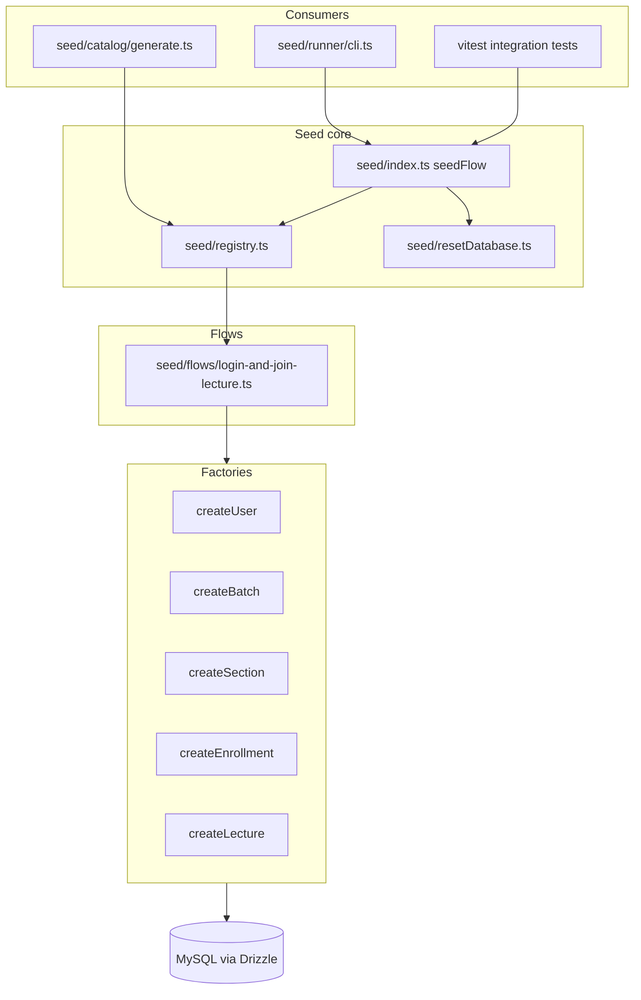

# Layered Test-Data Seeding Framework

## Context gathered

- Manual seed logic in [`lecture-join-seed.txt`](lecture-join-seed.txt) uses **Prisma**; the app uses **Drizzle** via [`src/db/index.ts`](src/db/index.ts) and [`src/db/schema.ts`](src/db/schema.ts).
- No existing `/seed/` folder — greenfield.
- **Join-lecture eligibility** is enforced in app code, not DB constraints:
  - [`resolveJoinLiveButtonState`](src/server/learn/utils/resolveJoinLiveButtonState.ts): requires `zoomLink`, valid `schedule`, and `now` within the window `[schedule − 5 min, concludes]`.
  - Raw script sets `schedule = now` → join button is **`active`** immediately (no clock mocking needed).
- **Enrollment path**: `section_user` → `sections.batch_id` is what the app uses ([`getBatchIdsForEnrolledUser`](src/server/batches/getBatchIdsForEnrolledUser.ts), [`getSectionIdsForUserInBatch`](src/server/batches/getSectionIdsForUserInBatch.ts)). `batch_user` is **not** required for this flow.
- **Drizzle gaps vs Prisma script**: `sections` requires non-null `assignmentPercentageWeightage` / `attendancePercentageWeightage` — factories must supply defaults (e.g. `0`).
- CLI runtime: **`npm run seed <flow-id>`** via `tsx` (confirmed).



## Folder structure

```
seed/
  README.md
  index.ts                    # public API: seedFlow, resetDatabase, listFlows
  registry.ts                 # imports all flows; single metadata source
  resetDatabase.ts            # reusable table reset
  types.ts                    # SeedFlow, SeedFlowResult, TestUser, timing types
  utils/
    time.ts                   # relative offset → MySQL datetime/date strings
    constants.ts              # shared dev password hash ("password")
  factories/
    index.ts
    createUser.ts
    createBatch.ts
    createSection.ts
    createEnrollment.ts       # inserts into section_user
    createLecture.ts
  flows/
    login-and-join-lecture.ts
  runner/
    cli.ts                    # npm entry
  catalog/
    generate.ts               # writes seed/catalog/index.html from registry
    index.html                # generated artifact (gitignored or committed — prefer committed for easy open)
```

Add npm scripts to [`package.json`](package.json):

```json
"seed": "tsx seed/runner/cli.ts",
"seed:catalog": "tsx seed/catalog/generate.ts"
```

## Layer 1 — Entity factories

Each factory in `seed/factories/`:

- Imports table + insert types from [`@/db/schema`](src/db/schema.ts) and uses [`db`](src/db/index.ts).
- Signature: `createX(overrides?: Partial<InsertType>): Promise<SelectType>`.
- Applies sensible defaults; merges `overrides` last.
- **Zero imports from `/seed/flows/`**.

| Factory            | Table          | Key defaults (from raw script + schema)                                                              |
| ------------------ | -------------- | ---------------------------------------------------------------------------------------------------- |
| `createUser`       | `users`        | admin/student emails, bcrypt hash for `"password"`, `role`, `status: 'active'`, `client: 'masai'`    |
| `createBatch`      | `batches`      | `FT-MOCK-1`, `starting` from time helper, `duration: '30 weeks'`, `program: 'FT'`, `active: 1`       |
| `createSection`    | `sections`     | `FT-MOCK-1-SEC-A`, `type: 'regular'`, weightages `0`, links `batchId`                                |
| `createEnrollment` | `section_user` | `role: 'student'`, links `sectionId`, `userId`, `managerId`                                          |
| `createLecture`    | `lectures`     | `type: 'live'`, `category: 'course'`, `zoomLink`, `week/day: 1`, schedule/concludes from time helper |

Shared dev password constant (reuse existing hash from raw script):

```ts
// seed/utils/constants.ts
export const DEV_PASSWORD_PLAINTEXT = 'password'
export const DEV_PASSWORD_BCRYPT =
  '$2a$12$QW35QDkcHSMAtEEGZMwAF.B7MzGYy1OaZU09wmb9l2kGC2SBMJAOO'
```

## Layer 2 — Time handling (`seed/utils/time.ts`)

Small pure helpers — no clock injection:

- `formatMysqlDate(d: Date): string` — `YYYY-MM-DD` for `batches.starting`
- `formatMysqlDatetime(d: Date): string` — for `lectures.schedule` / `concludes`
- `offsetFromNow({ daysAgo?, minutesAgo?, minutesFromNow? }): Date`

Used by flows to resolve offsets at seed time only.

## Layer 3 — First flow: `login-and-join-lecture`

File: [`seed/flows/login-and-join-lecture.ts`](seed/flows/login-and-join-lecture.ts)

**Config metadata** (machine-readable, exported alongside `seed`):

```ts
export const loginAndJoinLectureFlow = {
  id: 'login-and-join-lecture',
  description:
    'Student can log in and join a live lecture with an active join button.',
  timing: {
    batchStartedDaysAgo: 0,
    lectureScheduledMinutesAgo: 0, // schedule = now → join active
    lectureDurationMinutes: 120, // concludes = schedule + 2h
  },
  seedCommand: 'npm run seed login-and-join-lecture',
}
```

**`seed()` composition** (mirrors raw script order):

1. `createUser` → admin (`admin@example.com`)
2. `createUser` → student (`student@example.com`)
3. `createBatch` → `starting: offsetFromNow({ daysAgo: 0 })`
4. `createSection` → linked to batch
5. `createEnrollment` → student in section, manager = admin
6. `createLecture` → `schedule: now`, `concludes: now + 120min`, `zoomLink: 'https://us06web.zoom.us/j/89929641190'`, `userId: admin.id`

**Return value** (`SeedFlowResult`):

```ts
{
  flowId: 'login-and-join-lecture',
  entities: { admin, student, batch, section, enrollment, lecture },
  testUsers: [
    { role: 'admin', email, password: DEV_PASSWORD_PLAINTEXT, userId, name },
    { role: 'student', email, password: DEV_PASSWORD_PLAINTEXT, userId, name },
  ],
  timing: { /* resolved absolute timestamps for catalog/debug */ },
}
```

`testUsers` is built from **inserted rows**, not a parallel hardcoded list — emails/password constant come from factory defaults unless overridden.

## Layer 4 — Registry ([`seed/registry.ts`](seed/registry.ts))

- Import flow modules; expose:
  - `seedFlows: Record<string, SeedFlowModule>`
  - `listFlows(): SeedFlowMeta[]`
  - `getFlow(id: string): SeedFlowModule` (throws on unknown id)
- Catalog and CLI read **only** from here.

## Layer 5 — Reset + runner

### `resetDatabase()` ([`seed/resetDatabase.ts`](seed/resetDatabase.ts))

Reusable, callable from CLI and tests:

1. Guard: throw if `NODE_ENV === 'production'`.
2. Load env via `import 'dotenv/config'` (same pattern as [`drizzle.config.ts`](drizzle.config.ts)).
3. Query `information_schema.TABLES` for current schema.
4. Exclude preserve list: `_prisma_migrations` (only table that must survive).
5. `SET FOREIGN_KEY_CHECKS = 0` → `TRUNCATE TABLE` each → re-enable FK checks.
6. Use a dedicated connection/pool (can reuse `db` + raw SQL via `db.execute`).

Document clearly in README: **wipes all app data** in the connected database; intended for local/dev test DBs only.

### CLI ([`seed/runner/cli.ts`](seed/runner/cli.ts))

```
npm run seed                     # list flows
npm run seed login-and-join-lecture
npm run seed login-and-join-lecture --no-reset   # optional flag
```

Steps: parse args → `resetDatabase()` (default) → `seedFlow(id)` → print JSON summary + credentials table.

### Public API ([`seed/index.ts`](seed/index.ts))

```ts
export async function seedFlow(
  flowId: string,
  options?: { reset?: boolean },
): Promise<SeedFlowResult>
```

Future test usage (no shell):

```ts
import { seedFlow } from '../seed'
const { entities, testUsers } = await seedFlow('login-and-join-lecture')
```

## Layer 6 — Catalog ([`seed/catalog/generate.ts`](seed/catalog/generate.ts))

- Reads `listFlows()` from registry.
- For each flow, renders: id, description, seed command, timing offsets, **default credential emails** (from factory constants — with note that IDs come from last seed run).
- Writes self-contained `seed/catalog/index.html` (minimal CSS, no hand-maintained content).
- Run: `npm run seed:catalog` (also invoked post-seed optionally, or documented as separate step).

## Tests and docs (per repo guidelines)

Colocated vitest files under `seed/`:

| Module                                 | Cases                                                                                                                                                                                                   |
| -------------------------------------- | ------------------------------------------------------------------------------------------------------------------------------------------------------------------------------------------------------- |
| `utils/time.test.ts`                   | offset math, MySQL formatting                                                                                                                                                                           |
| `registry.test.ts`                     | known flow registered, unknown id throws                                                                                                                                                                |
| `catalog/generate.test.ts`             | HTML contains flow id + command from registry                                                                                                                                                           |
| `flows/login-and-join-lecture.test.ts` | **unit**: mock factories, assert composition + `testUsers` shape; **optional integration** (skipped unless `SEED_INTEGRATION=1` + `DATABASE_URL`) validates join state via `resolveJoinLiveButtonState` |

Update testing docs:

- [`docs/testing/feature-test-matrix.md`](docs/testing/feature-test-matrix.md) — add `seed-framework` row
- New [`docs/testing/features/seed-framework.md`](docs/testing/features/seed-framework.md)

## README (`seed/README.md`)

Cover:

1. Prerequisites: local `.env` with `DATABASE_URL`, non-production
2. Run a flow: `npm run seed login-and-join-lecture`
3. Regenerate catalog: `npm run seed:catalog`
4. How to add a factory (template + exports from `factories/index.ts`)
5. How to add a flow (new file + register in `registry.ts`)
6. How catalog stays in sync (generated from registry only)
7. Programmatic use from tests (`seedFlow`)

## Key implementation notes

- **Path aliases**: factories import `@/db` — run via `tsx` with project [`tsconfig.json`](tsconfig.json) (already includes root `**/*.ts`).
- **Env loading**: top of `cli.ts` and `index.ts` side-effect: `import 'dotenv/config'` before `@/db` import.
- **Lecture joinability validation**: after seeding in integration test, assert `resolveJoinLiveButtonState({ schedule, concludes, zoomLink, nowMs: Date.now() }) === 'active'`.
- **No Prisma**: delete or leave [`lecture-join-seed.txt`](lecture-join-seed.txt) as reference only; framework replaces it.
- **Extensibility**: adding `attempt-assignment` later = new factories (if needed) + new flow file + one registry import — no structural changes.
