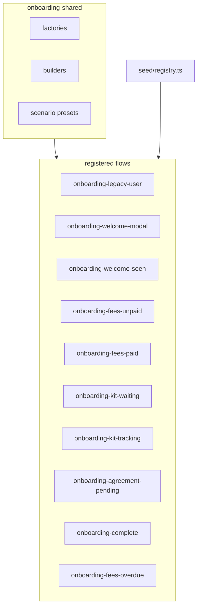

# T0 Student Onboarding Seed Flows

## Goal

Implement the [Onboarding (T0).md](<Onboarding%20(T0).md>) data model in `seed/`, with **one registry flow per major mermaid branch**, sharing factories/builders underneath (same pattern as [seed/flows/login-and-join-lecture/](seed/flows/login-and-join-lecture/)).

## Architecture



**Layering (unchanged repo convention):**

- `seed/factories/` — atomic inserts (no flow knowledge)
- `seed/flows/onboarding-shared/` — batch/sections/lectures/admission presets reused by all flows
- `seed/flows/onboarding-<branch>/` — thin `config.ts` + `seed.ts` per branch
- `seed/registry.ts` — register every flow ID

## Flow catalog (one per mermaid branch)

| Flow ID                        | Starting state                         | Key DB differences                                                                             |
| ------------------------------ | -------------------------------------- | ---------------------------------------------------------------------------------------------- |
| `onboarding-legacy-user`       | No T0 UI                               | Student enrolled in batch **without** `user_batch_admission_data`                              |
| `onboarding-welcome-modal`     | First login welcome                    | Admission row exists; `users.meta = {}`                                                        |
| `onboarding-welcome-seen`      | Past welcome                           | `users.meta.showWelcomeModal = true`                                                           |
| `onboarding-fees-unpaid`       | LMS walkthrough only + payment banner  | `full_fees_paid = 0`, `course_fee_deadline = now + 7d`                                         |
| `onboarding-fees-paid`         | Program onboarding tab , steps pending | `full_fees_paid = 1`; `batch_info` docs + kit enabled; agreement configured on program section |
| `onboarding-kit-waiting`       | Kit details filled, no tracking        | `student_kit_details_filled = 1`, `student_kit_tracking_url = NULL`                            |
| `onboarding-kit-tracking`      | Tracking visible                       | `student_kit_tracking_url` set                                                                 |
| `onboarding-agreement-pending` | Agreement modal open                   | Paid preset + **no** `profiles.legal_data` acceptance                                          |
| `onboarding-complete`          | ID card unlocked                       | LMS + program progress complete; `id_card_url` HTTPS URL                                       |
| `onboarding-fees-overdue`      | Expired payment window                 | `course_fee_deadline` in the past, still unpaid                                                |

All “new journey” flows use the **same builder shape** (batch → 4 sections → paired lectures → student enrollment) but **each flow creates its own isolated rows** — unique users, batch, sections, and lectures. Only scenario flags differ.

## Seed data isolation (required)

Every flow — onboarding **and** existing flows like `login-and-join-lecture` — must seed **non-colliding data** so multiple flows can coexist in one database:

```bash
npm run seed login-and-join-lecture -- --no-reset
npm run seed onboarding-welcome-modal -- --no-reset
npm run seed onboarding-fees-unpaid -- --no-reset
# …all flows in sequence without reset — each must still work independently
```

**Rules (enforce in code + document in guidelines):**

| Entity    | Isolation strategy                                                                                                    |
| --------- | --------------------------------------------------------------------------------------------------------------------- |
| Users     | Flow-scoped emails, e.g. `onboarding-welcome-modal.student@example.com`, `onboarding-welcome-modal.admin@example.com` |
| Batch     | Flow-scoped name, e.g. `SDE Batch 42 [onboarding-welcome-modal]`                                                      |
| Sections  | New auto-increment IDs per batch (natural isolation when batch is unique)                                             |
| Lectures  | New rows per section; titles namespaced if needed, e.g. `How to submit assignments [welcome-modal]`                   |
| Admission | One row per (user, batch) pair — unique because user+batch are unique per flow                                        |

`buildOnboardingWorld(flowId, scenario)` takes `flowId` as the namespace prefix for all human-readable identifiers. Never hardcode shared emails like `student@example.com` across onboarding flows.

**Guidelines update:** Add a **Seed Framework** section to [`.cursor/rules/project-coding-guidelines.mdc`](.cursor/rules/project-coding-guidelines.mdc) (surfaced via [`CLAUDE.md`](CLAUDE.md)) stating: _each seed flow must create its own users, batch, sections, and lectures; flows must not assume exclusive ownership of shared rows and must work when every flow has been seeded with `--no-reset`._

**Test:** `SEED-ISOLATION-001` — seed two onboarding flows back-to-back with `{ reset: false }`, assert distinct `userId` / `batchId` and both students resolve correct T0 status.

## Shared world skeleton (from doc)

Seeded in this order inside `seed/flows/onboarding-shared/buildOnboardingWorld.ts` — **once per flow invocation**, namespaced by `flowId`:

1. **Admin + student users** via `[createUser](seed/factories/createUser.ts)` with flow-scoped emails
2. **Batch** — `SDE Batch 42 [${flowId}]`, `program: "SDE"`, `active: 1` via `[createBatch](seed/factories/createBatch.ts)`
3. **4 sections** via `[createSection](seed/factories/createSection.ts)`:

| `sections.type`          | `sections.name`            | Lecture `videos` source                                       |
| ------------------------ | -------------------------- | ------------------------------------------------------------- |
| `lms-walkthrough-web`    | `LMS Walkthrough - Web`    | Web recording URL (below)                                     |
| `lms-walkthrough-app`    | `LMS Walkthrough - App`    | App recording URL (below)                                     |
| `program-onboarding-web` | `Program Onboarding - Web` | Web recording URL (reuse until program-specific assets exist) |
| `program-onboarding-app` | `Program Onboarding - App` | App recording URL (reuse until program-specific assets exist) |

- Program sections also get `settings.agreements` with `shouldModalBeVisible: true` + valid `posh` sub-key (`pdfUrl`, `heading`) — required by `[getT0FlowLectures](src/server/api/dashboard/getT0FlowLectures.service.ts)` agreement detection

**Recording URLs** (stored in `lectures.videos` as a JSON string array):

- **LMS Walkthrough - Web** → `https://coding-platform.s3.amazonaws.com/dev/lms/tickets/47112992-c5fc-4d05-869a-90a4c53b5654/ciMpbypYUXGkMgHn.mp4`
- **LMS Walkthrough - App** → `https://coding-platform.s3.amazonaws.com/dev/lms/tickets/1bf6eecd-adba-4ff4-8a7c-8918d19995a6/kjfYWNpFgLfFSVyI.mp4`

Define in `seed/flows/onboarding-shared/constants.ts` as `ONBOARDING_LMS_WEB_VIDEO_URL` / `ONBOARDING_LMS_APP_VIDEO_URL`; `resolveSectionVideos(sectionName)` picks the correct URL.

4. **2–3 lectures per section** via extended `[createLecture](seed/factories/createLecture.ts)`:

- `type: 'video'`, `videos: [resolveSectionVideos(section.name)]` (required — service filters lectures without video URLs)
- **Identical titles** across web/app siblings for cross-platform sync testing (titles include flow namespace to avoid cross-flow confusion)

5. **Enrollments** — student in all 4 sections via `[createEnrollment](seed/factories/createEnrollment.ts)`
6. **`batch_info`** rows (docs + kit flags) when program steps should appear
7. **`profiles`** row for student (agreement acceptance toggled per scenario)

## New factories

| Factory                        | Table                       | Notes                                                                                                                                                                                                                           |
| ------------------------------ | --------------------------- | ------------------------------------------------------------------------------------------------------------------------------------------------------------------------------------------------------------------------------- |
| `createUserBatchAdmissionData` | `user_batch_admission_data` | Table exists in [drizzle/schema.ts](drizzle/schema.ts) but not [src/db/schema.ts](src/db/schema.ts). **Add typed table export to `src/db/schema.ts`** (copy from drizzle) so inserts use Drizzle builder per project guidelines |
| `createBatchInfo`              | `batch_info`                | Requires `makerId` + `checkerId` → use admin user                                                                                                                                                                               |
| `createProfile`                | `profiles`                  | Minimal row; `legalData` preset for agreement-complete scenarios                                                                                                                                                                |
| `createUserDeviceToken`        | `user_device_tokens`        | Used in `onboarding-complete` to mark app-download step done                                                                                                                                                                    |
| `createVideoAttendance`        | `video_attendances`         | Used in `onboarding-complete` to fast-forward lecture steps (`duration >= 10`)                                                                                                                                                  |

Extend existing factories only where needed:

- `[createLecture](seed/factories/createLecture.ts)` — default `videos` array + `type: 'video'` for onboarding callers
- `[createUser](seed/factories/createUser.ts)` — accept `meta` override (already via spread)

## Scenario presets

`seed/flows/onboarding-shared/scenarios.ts` exports typed presets consumed by thin flow seeders:

```ts
type OnboardingScenario = {
  includeAdmission: boolean
  userMeta?: Record<string, unknown>
  admission?: Partial<AdmissionFields> // full_fees_paid, deadlines, kit fields, id_card_url, meta fractions
  batchInfo?: { documentsRequired?: boolean; studentKit?: boolean }
  profile?: { legalData?: Record<string, unknown> }
  deviceToken?: boolean
  videoAttendances?: 'none' | 'all-lms' | 'all'
}
```

Each `seed/flows/onboarding-<branch>/seed.ts` calls `buildOnboardingWorld(flowId, scenarioPreset)` and returns `SeedFlowResult`.

## Types & registry

- Extend `[seed/types.ts](seed/types.ts)`:
  - `OnboardingEntities` (batch, sections map, lectures, admission, profile, batchInfo, enrollments)
  - `SeedFlowResult.entities` becomes a union: `LoginAndJoinLectureEntities | OnboardingEntities`
- Register all 10 flows in `[seed/registry.ts](seed/registry.ts)` (config import + `loadFlowModule` case per ID)
- Add shared constants in `seed/flows/onboarding-shared/constants.ts`: section-type strings, LMS web/app video URLs, `flowScopedEmail(flowId, role)` helper, placeholder ID-card URL
- **Do not** add a single shared `DEFAULT_ONBOARDING_STUDENT_EMAIL` — emails are always flow-scoped

## Verification hooks (tests)

**Unit tests** (mocked DB/factories, same style as `[login-and-join-lecture.test.ts](seed/flows/login-and-join-lecture.test.ts)`):

- `onboarding-shared/buildOnboardingWorld.test.ts` — correct factory call order + scenario flag wiring
- One lightweight test per flow confirming it picks the right scenario preset

**Opt-in integration tests** (`SEED_INTEGRATION=1` + `DATABASE_URL`):

- `onboarding-welcome-modal` → `[getWelcomeModalStatus](src/server/api/dashboard/getWelcomeModalStatus.service.ts)` returns `{ showWelcomeModal: true }`
- `onboarding-legacy-user` → `{ showWelcomeModal: false }`, `[getT0FlowStatus](src/server/api/dashboard/getT0FlowStatus.service.ts)` `{ showT0Flow: false }`
- `onboarding-fees-unpaid` → `showT0Flow: true`, `showProgramTab: false`; `[getPaymentBannerInfo](src/server/api/dashboard/getPaymentBannerInfo.service.ts)` non-null
- `onboarding-fees-paid` → `showProgramTab: true`; `getT0FlowLectures` returns LMS + program lectures, `isDocumentsRequired` + `isStudentKitApplicable` true
- `onboarding-complete` → `idCardUrl` populated; legal agreements marked complete

## Docs & catalog

- Update `[seed/README.md](seed/README.md)` with onboarding flow list, scenario table, **isolation rules**, and example multi-flow command sequence (`--no-reset`)
- Add **Seed Framework** subsection to `[.cursor/rules/project-coding-guidelines.mdc](.cursor/rules/project-coding-guidelines.mdc)` (auto-imported by `[CLAUDE.md](CLAUDE.md)`): every flow creates its own users/batch/sections/lectures; must not collide when composed
- Update `[docs/testing/features/seed-framework.md](docs/testing/features/seed-framework.md)` and `[docs/testing/feature-test-matrix.md](docs/testing/feature-test-matrix.md)` with new SEED-FLOW / SEED-INT / SEED-ISOLATION cases
- Run `npm run seed:catalog` so catalog Login buttons work for each onboarding flow's student

## Implementation order

1. **Schema + factories** — add `userBatchAdmissionData` to `src/db/schema.ts`; implement 5 new factories; export from `[seed/factories/index.ts](seed/factories/index.ts)`
2. **Shared builder** — `onboarding-shared/` constants, scenarios, `buildOnboardingWorld`
3. **Flows (incremental)** — start with the 4 highest-value branches (`legacy-user`, `welcome-modal`, `fees-unpaid`, `fees-paid`), then add the remaining 6
4. **Registry + types + tests + docs + isolation guidelines**
5. **Validate** — `npm run typecheck`, `npm run test -- seed/`, manual compose test:
   ```bash
   npm run seed onboarding-welcome-modal
   npm run seed onboarding-fees-unpaid -- --no-reset
   npm run seed login-and-join-lecture -- --no-reset
   ```
   Confirm all three students log in and land in the correct UI state.

## Out of scope (per doc)

- Automated ban on overdue fees (`users.status = 'banned'`) — not implemented in app today
- Batch start-date banner — column/UI not built yet
- Onward webhook simulation — seed sets DB flags directly (`student_kit_details_filled`, etc.) instead of external callbacks
