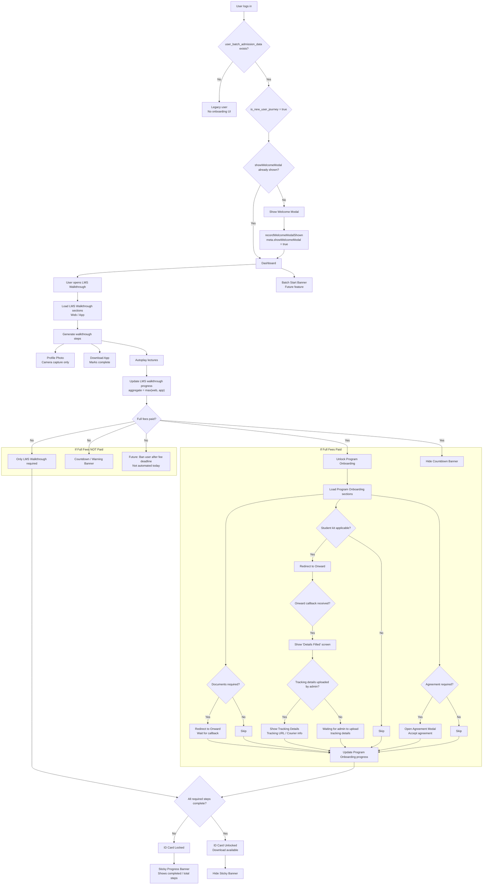

## INFO

The Student Onboarding flow is what a brand-new student sees from the moment they log into the LMS for the first time until they're fully verified and admitted.

In short:

1. First login → a one-time Welcome Modal appears (tracked via a flag on the user, never shown again after).
2. LMS Walkthrough → a short guided tour (via the `?` icon and on the dashboard) that teaches the student how to use the LMS — watch a few intro videos, set a profile photo (camera capture only), and download the mobile app. This is required for everyone, regardless of payment status.
3. Program Onboarding → only unlocked once the student has paid full fees. It handles the "real" admission paperwork: uploading documents, ordering/tracking a student kit, and signing any required agreements — each of these can be turned on/off per batch, and document/kit steps are actually handled by an external system ("Onward") that calls back into the LMS when done.
4. ID Card → stays locked until both the walkthrough and (if applicable) program onboarding are fully complete; once done, the student can download it.
5. Nudges along the way:
  - A sticky banner on the dashboard shows "X/Y steps done" until everything's complete, and grows in scope (denominator) as more sections unlock (e.g., paying full fee adds the program-onboarding steps to the count).
    - A payment countdown banner nags the student as their fee deadline approaches/passes (Timer → Warning tiers), meant to eventually escalate to a ban if they never pay (not automated yet).
    - A batch start-date banner would show when their course begins (this one isn't built yet).

Essentially: prove you're a real student (photo, app) → learn the platform (walkthrough) → complete admission formalities (docs/kit/agreement, gated by full payment) → get your ID card, with banners at each stage reminding the student what's left and applying pressure around payment deadlines.

## DB SEED

Order matters — seed in this sequence: `batches` → `sections` → `lectures` → `users` → `user_batch_admission_data` (+ `section_user`, `profiles`, `batch_info`).

### `batches`


| Field      | Value to seed              | Effect                                                                                            |
| ---------- | -------------------------- | ------------------------------------------------------------------------------------------------- |
| `id`       | e.g. `9001`                | FK target for everything below                                                                    |
| `name`     | `"SDE Batch 42"`           | Shown in sticky banner as `"-course title"` when user has multiple batches                        |
| `duration` | `NULL` (Masai) or `"ihub"` | Controls Masai vs iHub portal filtering (`isBatchVisibleOnPortal`) — set `NULL` for a normal test |
| `active`   | `true`                     | Inactive batches are filtered out                                                                 |
| `program`  | `"SDE"`                    | Course/program label                                                                              |


### `sections` (create 4, two per walkthrough type, web+app)


| Field                                              | Value                                                                                               | Effect                                                                                                                                                                                                                        |
| -------------------------------------------------- | --------------------------------------------------------------------------------------------------- | ----------------------------------------------------------------------------------------------------------------------------------------------------------------------------------------------------------------------------- |
| `batch_id`                                         | `9001`                                                                                              | Links to the batch above                                                                                                                                                                                                      |
| `type`                                             | `lms-walkthrough-web`, `lms-walkthrough-app`, `program-onboarding-web`, `program-onboarding-app`    | These exact strings drive `SECTION_TYPE_TO_META_KEY` in `guidedTourStep.service.ts:61-66` — anything else is ignored silently                                                                                                 |
| `active`                                           | `true`                                                                                              | Inactive sections are excluded from denominator counts                                                                                                                                                                        |
| `deleted_at`                                       | `NULL`                                                                                              | Soft-deleted sections excluded                                                                                                                                                                                                |
| `settings` (JSON, only for `program-onboarding-*`) | `{ "agreements": { "posh": { "shouldModalBeVisible": true, "heading": "...", "pdfUrl": "..." } } }` | `shouldModalBeVisible: true` is what turns on the Agreement step (`batchHasAgreementStep`, `isBatchAgreementAccepted` in `guidedTourProgress.service.ts:216-283`) — omit this key entirely to test "agreement not configured" |


### `lectures` (2–3 per section)


| Field        | Value                                                                                                          | Effect                                                                                                                                                                                                                                                           |
| ------------ | -------------------------------------------------------------------------------------------------------------- | ---------------------------------------------------------------------------------------------------------------------------------------------------------------------------------------------------------------------------------------------------------------- |
| `section_id` | matching section id                                                                                            | Each row = one "step" in the walkthrough denominator                                                                                                                                                                                                             |
| `batch_id`   | `9001`                                                                                                         |                                                                                                                                                                                                                                                                  |
| `deleted_at` | `NULL`                                                                                                         |                                                                                                                                                                                                                                                                  |
| `title`      | keep identical text between the `-web` and `-app` sibling lecture (e.g. `"How to submit assignments"` in both) | The sibling-sync logic (`normalizeTitleForMatch`, `guidedTourStep.service.ts:296-310`) marks the app lecture done automatically when the matching-titled web lecture is completed, and vice versa — mismatched titles = no cross-platform sync, useful test case |
| `schedule`   | any date                                                                                                       | Used as fallback attendance timestamp                                                                                                                                                                                                                            |


### `users`


| Field                | Value                                                                                     | Effect                                                                                                              |
| -------------------- | ----------------------------------------------------------------------------------------- | ------------------------------------------------------------------------------------------------------------------- |
| `meta`               | `{}` (empty) for a fresh user, or `{"showWelcomeModal": true}` to simulate "already seen" | `showWelcomeModal !== true` ⇒ modal shows (`user/resolver.ts:198-201`). To test "seen once" state, set it to `true` |
| `profile_photo_path` | `NULL` initially                                                                          | Used as one of 3 "extra" LMS-walkthrough steps (`userHasProfilePhoto`)                                              |
| `status`             | `NULL` / `"active"`                                                                       | Set to `"banned"` + `status_time` to simulate the (currently manual) ban outcome                                    |
| `email`              | real-looking, used by Zoom-active check                                                   | If Zoom API call fails/throws it's silently treated as incomplete — fine for local seed                             |


### `user_batch_admission_data` — the real hub, one row per (user, batch)


| Field                                                               | Value to seed                                      | Effect on flow                                                                                                                                                                                                                                                              |
| ------------------------------------------------------------------- | -------------------------------------------------- | --------------------------------------------------------------------------------------------------------------------------------------------------------------------------------------------------------------------------------------------------------------------------- |
| `user_id`, `batch_id`                                               | link to seeded rows                                | Presence of any row ⇒ `is_new_user_journey = true` (old users with no row skip onboarding entirely)                                                                                                                                                                         |
| `lms_access_date`                                                   | e.g. `now()`                                       | Base for the payment-banner timer math (`timerBannerEndDate` etc. in `user/resolver.ts:312+`)                                                                                                                                                                               |
| `course_fee_deadline`                                               | `now() + 7 days` (or a past date to test overdue)  | Drives Payment Pending Countdown; a past date should trigger the "expired" branch (which today returns `null`/no ban — good test to confirm the gap)                                                                                                                        |
| `full_fees_paid`                                                    | `false`                                            | Only LMS walkthrough required; program-onboarding section is skipped entirely (`recordGuidedTourStepCompleted` returns early if `full_fees_paid` is false, `guidedTourStep.service.ts:334-341`)                                                                             |
| `full_fees_paid`                                                    | `true`                                             | Both LMS + Program Onboarding count toward completion (`isBatchOnboardingComplete`)                                                                                                                                                                                         |
| `full_fees_paid_date`, `full_fees_amount`, `full_fees_paid_invoice` | any                                                | Cosmetic                                                                                                                                                                                                                                                                    |
| `payment_url`                                                       | a URL string                                       | Needed to show the "Payment Banner" once fees are paid but a payment_url still exists (edge case in resolver)                                                                                                                                                               |
| `student_kit_exists`                                                | `true`/`false`                                     | Gate for Student Kit step (paired with `batch_info` flag below)                                                                                                                                                                                                             |
| `student_kit_details_filled`                                        | `true`/`false`                                     |                                                                                                                                                                                                                                                                             |
| `student_kit_tracking_url`                                          | a tracking string                                  | This is the "Tracking Id" shown once admin uploads it                                                                                                                                                                                                                       |
| `id_card_url`                                                       | `NULL` until all onboarding steps done, then a URL | ID card stays locked (`idCardUrl` resolver returns whatever's in DB — your frontend should gate display on `isComplete`)                                                                                                                                                    |
| `meta`                                                              | `{}` initially                                     | Progress fractions get written here automatically as `lms_walkthrough_web`, `lms_walkthrough_app`, `lms_walkthrough` (aggregate = max of both), `program_onboarding_web/app` — you can also hand-seed e.g. `{"lms_walkthrough": "3/7"}` to jump straight to a partial state |


### `batch_info` (per batch, key-value)


| `item`                         | `value`                                               | Effect                                                |
| ------------------------------ | ----------------------------------------------------- | ----------------------------------------------------- |
| `"Documents required"`         | any non-empty string                                  | Turns on "Upload Document" step in Program Onboarding |
| `"Is Student Kit applicable?"` | `"true"` (must be literal string `"true"`, lowercase) | Turns on Student Kit step                             |


### `profiles`


| Field        | Value                                                                           | Effect                                                                                                                                |
| ------------ | ------------------------------------------------------------------------------- | ------------------------------------------------------------------------------------------------------------------------------------- |
| `legal_data` | `{"agreements": {"section_<sectionId>": {"haveAcceptedLegalAgreement": true}}}` | Marks agreement accepted for that specific program-onboarding section id — key must be `section_{id}` matching the section you seeded |


### `video_attendances` (optional — normally written by the app, but you can seed to fast-forward)


| Field                   | Value                                          | Effect                                                 |
| ----------------------- | ---------------------------------------------- | ------------------------------------------------------ |
| `user_id`, `lecture_id` | matching seed                                  |                                                        |
| `duration`              | `>= 10` (the `MIN_DURATION_THRESHOLD_PERCENT`) | Counts that lecture as "completed" toward the fraction |


### `user_device_tokens`

Seed one row for a user to simulate "app downloaded" (counts as 1 of the 3 LMS-walkthrough extra steps and would back a "Download App" completed state).

## STRUCTURED YAML

```
flow: STUDENT_ONBOARDING
scope: per (user_id, batch_id) via user_batch_admission_data

steps:
  welcome_modal:
    status: EXISTS
    source: users.meta.showWelcomeModal (JSON boolean)
    flag_states:
      missing_or_false: { action: SHOW, once_per_user: true }
      true: { action: HIDE }
    mutation: recordWelcomeModalShown -> sets meta.showWelcomeModal = true
    overdue: n/a

  lms_walkthrough:
    status: EXISTS
    visible_at: batch_info
    source_sections: [lms-walkthrough-web, lms-walkthrough-app]
    progress_field: user_batch_admission_data.meta.lms_walkthrough (+ _web/_app)
    denominator: count(lectures in section) + 3   # profile photo, zoom active, app installed
    numerator: count(video_attendances.duration >= 10%) + extra_steps_completed
    extra_steps:
      profile_photo:
        rule: capture only, no upload
        source: users.meta.face_image OR profiles.meta.profile_pic OR users.profile_photo_path
      zoom_active:
        source: external zoom API check by email
      app_installed:
        source: user_device_tokens count > 0 (download-app modal completion)
    video_behavior: autoplay_next: true
    flag_states:
      "0/n": not_started
      "k/n (0<k<n)": in_progress
      "n/n": complete -> unlocks sticky-banner recompute, contributes to ID card gate
    web_app_sync: sibling lecture with identical title auto-marked complete on either platform

  program_onboarding:
    status: EXISTS
    visible_at: batch_level
    gate: user_batch_admission_data.full_fees_paid == true   # hidden entirely if false
    source_sections: [program-onboarding-web, program-onboarding-app]
    progress_field: user_batch_admission_data.meta.program_onboarding (+ _web/_app)
    denominator: count(lectures in section) + (1 if agreement_step_enabled else 0)
    steps:
      upload_document:
        enabled_if: batch_info[item="Documents required"].value is non-empty
        behavior: redirect_to_onward -> await_webhook_callback -> mark_step_done
      student_kit:
        enabled_if: batch_info[item="Is Student Kit applicable?"].value == "true"
        behavior: redirect_to_onward -> await_webhook_callback -> mark_step_done
        extra_display: student_kit_tracking_url (shown once admin sets it)
      agreement_signing:
        enabled_if: sections.settings.agreements[*].shouldModalBeVisible == true
        behavior: open_agreement_modal -> accept -> profiles.legal_data.agreements["section_{id}"].haveAcceptedLegalAgreement = true
    video_behavior: autoplay_next: true

  id_card:
    status: PARTIAL (field exists, lock logic must be enforced client-side)
    source: user_batch_admission_data.id_card_url
    flag_states:
      locked: any_required_step_incomplete == true
      unlocked: lms_walkthrough == complete AND (full_fees_paid == false OR program_onboarding == complete)
    action_on_unlock: allow_download(id_card_url)

  sticky_banner_complete_walkthrough:
    status: EXISTS (banner component present; denominator semantics match spec)
    visible_if: NOT (lms_walkthrough complete AND (fee-gated) program_onboarding complete)
    sticky_to: dashboard_page_only
    denominator_rule: sum of denominators of currently UNLOCKED sections only
    example:
      lms_only_unlocked: "6/8"
      after_full_fee_unlocks_program: "6/15"
    multi_course_label: append "- {batch.name}" when user has >1 incomplete batch (showOnboardingChip logic)
    disappears_when: isBatchOnboardingComplete == true

  payment_pending_countdown:
    status: PARTIAL (banner tiers exist; auto-ban NOT implemented)
    source: user_batch_admission_data.course_fee_deadline, lms_access_date
    tiers:
      timer_banner:
        window: lms_access_date -> lms_access_date + N days (config)
        shows: days_remaining
      warning_banner:
        window: timer_banner_end -> +7 days
        shows: days_remaining
      expired:
        window: after warning_banner_end
        current_behavior: banner returns null (no UI shown)
        spec_behavior: PLANNED - ban user (users.status='banned') at batch_user level
    disappears_when: full_fees_paid == true

  batch_start_date_banner:
    status: PLANNED (not implemented - batches table has no start_date column)
    would_source: batches.<new start_date column>
    text_template: "Your Course - {batch.program/name} will start on {start_date}"
    rotation_interval_seconds: 5

flags_legend:
  incomplete: step not started or partially done -> blocks dependent gates (id_card, sticky banner hides)
  done: step fully done -> contributes numerator, may unlock next-tier steps
  missing_config: e.g. no batch_info row / no agreement configured -> step treated as not-applicable, excluded from denominator
  overdue: course_fee_deadline passed without full_fees_paid -> today: no automated consequence (gap); spec: ban at batch_user level
```


## NOT IMPLEMENTED

- No automated ban when `course_fee_deadline` passes unpaid — the resolver comment literally says "user should be banned" but just returns `null`. Nothing touches `users.status` or `batch_user`.
- No `start_date` column on `batches` and no Batch Start Date banner component anywhere in the UI — the 5-second rotating banner doesn't exist yet.

