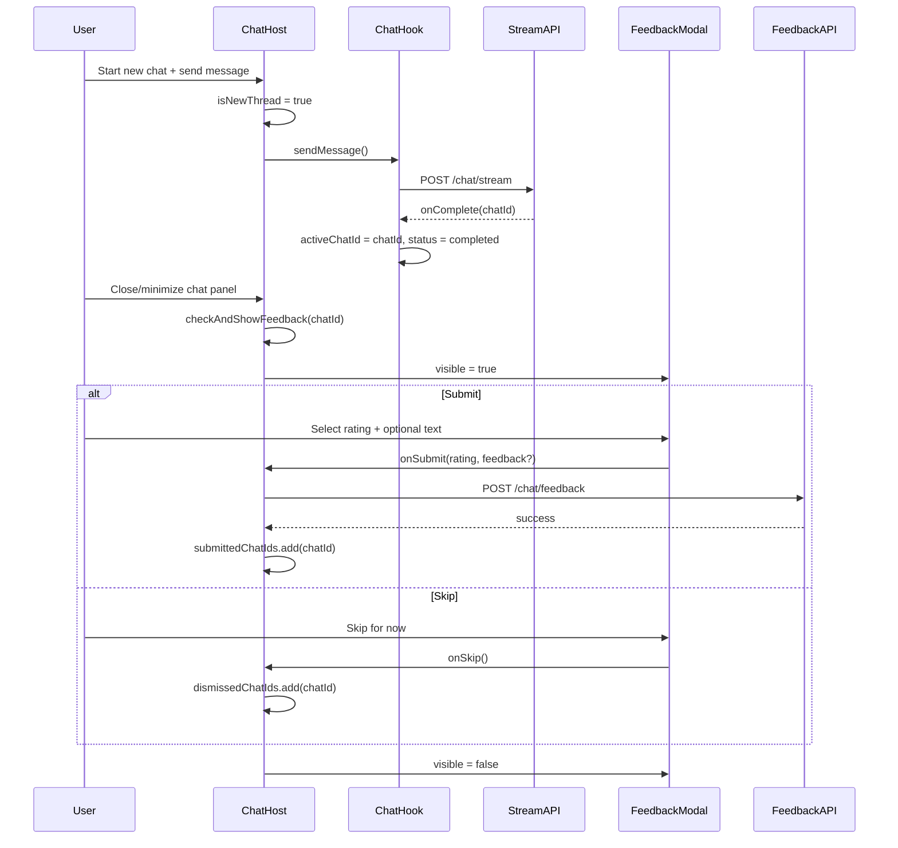

# Lecture AI Chat — Conversation Feedback

Last updated: 2026-07-06

Integration guide for the **per-conversation feedback** flow in Lecture AI Chat. Use this document to replicate the mobile (Expo) behavior on web.

**Related docs:**

- [AI Tutor Chat Stream API](./ai-tutor-chat-stream.md) — streaming chat and `chatId` assignment
- [Lecture AI Chat V1](./lecture-ai-chat.md) — overall chat feature spec

**Mobile reference implementation:**

| Area                  | File                                                                     |
| --------------------- | ------------------------------------------------------------------------ |
| Trigger + eligibility | `components/LectureDetails/LectureAIChat/LectureAIChatHost.tsx`          |
| Modal UI              | `components/LectureDetails/LectureAIChat/LectureAIChatFeedbackModal.tsx` |
| API client            | `services/lectureAiChat/feedback.ts`                                     |
| Types                 | `services/lectureAiChat/types.ts`                                        |

---

## Overview

After a student finishes a **new** AI chat conversation on the Lecture Details screen and **closes/minimizes** the chat panel, the app may show a lightweight feedback modal asking:

> **How helpful was this AI chat?**

The student rates the conversation (1–5) and can optionally leave a short text comment. Feedback is submitted **once per `chatId` per page visit** — not on every message, and not for conversations reopened from history.

| Property           | Value                                                                |
| ------------------ | -------------------------------------------------------------------- |
| Scope              | Per **conversation** (`chatId`), not per message                     |
| Trigger            | User **closes/minimizes** the chat drawer/panel                      |
| Eligible threads   | Only threads **newly started** during the current lecture page visit |
| Ineligible threads | Conversations loaded from **chat history**                           |
| Deduping           | In-memory for the current visit (submitted + skipped sets)           |
| API                | `POST /api/ai-tutor/chat/feedback`                                   |

---

## User flow

```mermaid
flowchart TD
  A[Student on Lecture Details] --> B{Starts new chat?}
  B -->|New chat / first message| C[Mark thread as feedback-eligible]
  B -->|Select from history| D[Mark thread as NOT eligible]
  C --> E[Student sends message(s)]
  E --> F[AI stream completes → chatId assigned]
  F --> G[Student closes/minimizes chat panel]
  G --> H{All eligibility checks pass?}
  H -->|Yes| I[Show feedback modal]
  H -->|No| J[Panel closes, no modal]
  I --> K{User action}
  K -->|Submit| L[POST feedback API]
  K -->|Skip / dismiss without rating| M[Record chatId as dismissed]
  L --> N[Record chatId as submitted]
  N --> O[Close modal]
  M --> O
  D --> P[Close panel — never show feedback]
```

### Step-by-step

1. Student opens Lecture Details with AI Chat enabled.
2. Student starts a **new** conversation (see eligibility rules below).
3. Student sends at least one message; AI responds and stream completes.
4. Backend assigns a `chatId` (returned on stream complete — see stream doc).
5. Student **minimizes/closes** the chat drawer or side panel.
6. If eligible, feedback modal appears over the lecture page.
7. Student selects a 1–5 rating, optionally adds text, and submits — or skips.
8. Same `chatId` is not prompted again during this page visit.

---

## When to show the modal (eligibility)

Run eligibility checks **at close/minimize time**, using the current `activeChatId`.

**Show the modal only if ALL conditions are true:**

| #   | Condition                                                   | Reason                                      |
| --- | ----------------------------------------------------------- | ------------------------------------------- |
| 1   | `activeChatId` is not null                                  | Need a persisted conversation to rate       |
| 2   | Thread was **newly initialized** this visit                 | History threads are excluded                |
| 3   | `isSending === false`                                       | Do not prompt while a response is streaming |
| 4   | At least one assistant message has `status === "completed"` | Student must have received a finished reply |
| 5   | `chatId` not in `submittedChatIds`                          | Already rated this visit                    |
| 6   | `chatId` not in `dismissedChatIds`                          | User already skipped this visit             |

### Pseudocode

```ts
function checkAndShowFeedback(chatId: number | null): void {
  if (!chatId) return
  if (!isNewThreadThisVisit) return
  if (isSending) return
  if (!messages.some((m) => m.role === 'assistant' && m.status === 'completed'))
    return
  if (submittedChatIds.has(chatId)) return
  if (dismissedChatIds.has(chatId)) return

  openFeedbackModal(chatId)
}
```

---

## New-thread vs history-thread tracking

Use a boolean flag (mobile uses a ref: `isNewThreadRef`) for the **current page visit**.

### Set `isNewThread = true` when:

- User taps **New chat**
- User sends the **first message** while `activeChatId` is null
- User taps a **suggestion chip** while `activeChatId` is null

### Set `isNewThread = false` when:

- User selects a conversation from **chat history**

```ts
// New chat
function handleNewChat() {
  isNewThread = true
  clearMessages()
  activeChatId = null
}

// History selection
async function handleSelectConversation(chatId: number) {
  isNewThread = false // never eligible for feedback
  await loadConversation(chatId)
}

// First message in a fresh thread
function handleSend(message: string) {
  if (!activeChatId) {
    isNewThread = true
    startNewConversation()
  }
  sendMessage(message)
}
```

---

## Trigger: close / minimize

On mobile, feedback is triggered when the bottom sheet collapses from expanded → collapsed (`onMinimize`).

**Web equivalent:** call `checkAndShowFeedback(activeChatId)` when the user:

- Closes the chat drawer / side panel / modal
- Collapses an expanded chat UI back to the minimized state
- Clicks the backdrop (if that action collapses chat)

**Do NOT trigger on:**

- Opening chat / focusing the input
- Opening chat history
- Sending a message
- Switching lecture tabs
- Entering fullscreen video
- While AI is still streaming

Capture `activeChatId` **before** any state reset that might clear it on close.

---

## State to maintain (per lecture page visit)

| State                  | Type                        | Purpose                             |
| ---------------------- | --------------------------- | ----------------------------------- |
| `feedbackVisible`      | `boolean`                   | Modal open/closed                   |
| `feedbackChatId`       | `number \| null`            | `chatId` being rated                |
| `isFeedbackSubmitting` | `boolean`                   | Disable actions during POST         |
| `feedbackSubmitError`  | `string \| null`            | Show retry message on failure       |
| `isNewThread`          | `boolean` (ref recommended) | Eligibility flag for current thread |
| `submittedChatIds`     | `Set<number>`               | Prevent re-prompt after submit      |
| `dismissedChatIds`     | `Set<number>`               | Prevent re-prompt after skip        |

Refs/sets are preferred over React state for dedupe sets so they don't cause extra re-renders.

### On submit success

```ts
await submitFeedback({ lectureId, chatId, rating, feedback, platform })
submittedChatIds.add(chatId)
closeModal()
```

### On skip

```ts
dismissedChatIds.add(chatId)
closeModal()
```

### On submit error

Keep modal open. Show: `"Failed to submit. Please try again or skip."`

---

## API contract

### Endpoint

```
POST /api/ai-tutor/chat/feedback
```

Same base URL as other AI Tutor endpoints (e.g. `EXPO_PUBLIC_STUDENTS_NEW_URL` on mobile).

### Authentication

| Client            | Auth                                                                                                       |
| ----------------- | ---------------------------------------------------------------------------------------------------------- |
| **Web (browser)** | Session cookie — use `credentials: 'include'` on `fetch` (same as [stream API](./ai-tutor-chat-stream.md)) |
| **Mobile**        | `Authorization: Bearer <token>`                                                                            |

### Request headers

```
Content-Type: application/json
Cookie: session=...          (web)
Authorization: Bearer ...    (mobile)
```

### Request body

```json
{
  "lectureId": 123,
  "chatId": 456,
  "rating": 4,
  "platform": "web",
  "feedback": "The explanation of useState was clear."
}
```

| Field       | Type                    | Required | Description                                                               |
| ----------- | ----------------------- | -------- | ------------------------------------------------------------------------- |
| `lectureId` | `number`                | Yes      | Lecture the chat belongs to                                               |
| `chatId`    | `number`                | Yes      | Conversation ID from stream/history API                                   |
| `rating`    | `1 \| 2 \| 3 \| 4 \| 5` | Yes      | Face-rating value                                                         |
| `platform`  | `string`                | Yes      | Client platform — use `"web"` on web; mobile sends `"ios"` or `"android"` |
| `feedback`  | `string`                | No       | Optional free-text comment (omit if empty)                                |

### Response

```json
{
  "success": true,
  "message": "Feedback submitted",
  "data": {
    "id": 789,
    "chatId": 456,
    "rating": 4
  }
}
```

| Field         | Type                | Description                  |
| ------------- | ------------------- | ---------------------------- |
| `success`     | `boolean`           | Whether submission succeeded |
| `message`     | `string?`           | Optional server message      |
| `data.id`     | `number \| string?` | Feedback record ID           |
| `data.chatId` | `number`            | Rated conversation           |
| `data.rating` | `number`            | Stored rating                |

### Example (web)

```ts
async function submitLectureAIChatFeedback(payload: {
  lectureId: number
  chatId: number
  rating: 1 | 2 | 3 | 4 | 5
  feedback?: string
}) {
  const body: Record<string, unknown> = {
    lectureId: payload.lectureId,
    chatId: payload.chatId,
    rating: payload.rating,
    platform: 'web',
  }
  if (payload.feedback?.trim()) {
    body.feedback = payload.feedback.trim()
  }

  const response = await fetch('/api/ai-tutor/chat/feedback', {
    method: 'POST',
    credentials: 'include',
    headers: { 'Content-Type': 'application/json' },
    body: JSON.stringify(body),
  })

  if (!response.ok) {
    throw new Error(`HTTP_${response.status}`)
  }

  return response.json()
}
```

---

## Modal UI specification

Dedicated feedback UI — do **not** reuse the voice AI Tutor rating component. Copy and visuals are specific to text chat.

### Layout

Bottom sheet / dialog style modal with semi-transparent backdrop (`rgba(0,0,0,0.45)`).

### Copy

| Element          | Text                                               |
| ---------------- | -------------------------------------------------- |
| Title            | How helpful was this AI chat?                      |
| Subtitle         | Your feedback improves the experience for everyone |
| Skip button      | Skip for now                                       |
| Submit button    | Submit                                             |
| Text placeholder | Share your valuable feedback… (optional)           |
| Error            | Failed to submit. Please try again or skip.        |

### Rating options (required before submit)

| Value | Emoji | Label             |
| ----- | ----- | ----------------- |
| 1     | 😞    | Not helpful       |
| 2     | 😕    | Slightly helpful  |
| 3     | 😐    | Somewhat helpful  |
| 4     | 🙂    | Very helpful      |
| 5     | 🤩    | Extremely helpful |

- Five emoji buttons in a horizontal row.
- Selecting one highlights it and shows the label in a pill below.
- Non-selected options dim when one is selected.
- Rating is **required** to enable Submit.

### Optional text input

- Shown only after a rating is selected.
- Max length: **500** characters.
- Show character counter (`{length}/500`); turn counter red when `length > 450`.
- Multiline (~3 lines tall).

### Buttons

| Button       | Enabled when                       | Action             |
| ------------ | ---------------------------------- | ------------------ |
| Skip for now | Not submitting                     | Skip (no API call) |
| Submit       | Rating selected and not submitting | POST feedback      |

Submit shows a loading spinner while the request is in flight. Both buttons disabled during submit.

### Dismiss / backdrop behavior

| User action                                              | Behavior                                         |
| -------------------------------------------------------- | ------------------------------------------------ |
| Click **Skip for now**                                   | Skip — add `chatId` to dismissed set             |
| Click **Submit**                                         | POST with rating + optional text                 |
| Click backdrop / press Escape **without** a rating       | Skip (same as skip)                              |
| Click backdrop / press Escape **with** a rating selected | Submit (auto-submit selected rating)             |
| Submit fails                                             | Keep modal open, show error, allow retry or skip |

The modal must never trap the user — always allow skip or dismiss.

### Design tokens (mobile parity)

| Token                    | Value     |
| ------------------------ | --------- |
| Brand purple             | `#6962AC` |
| Brand purple light       | `#F0EFFA` |
| Brand purple border      | `#D4D2F0` |
| Card background          | `#FFFFFF` |
| Title color              | `#111827` |
| Subtitle / skip text     | `#6B7280` |
| Border radius (card top) | `28px`    |
| Border radius (buttons)  | `14px`    |

### Accessibility

- Rating buttons: `role="radio"`, `aria-checked` when selected, `aria-label` = rating label.
- Submit: `aria-label="Submit feedback"`.
- Skip: `aria-label="Skip for now"`.
- Trap focus inside modal while open; restore focus on close.
- Support keyboard: Escape triggers dismiss logic above.

---

## Web implementation checklist

### Host / container component

- [ ] Own `feedbackVisible`, `feedbackChatId`, submit loading/error state
- [ ] Track `isNewThread` for current visit
- [ ] Track `submittedChatIds` and `dismissedChatIds` sets
- [ ] Wire `checkAndShowFeedback` to chat panel close/minimize handler
- [ ] Pass `lectureId` and captured `chatId` to submit handler

### Chat integration

- [ ] `activeChatId` set when stream completes (`onComplete` callback)
- [ ] `isSending` false only after stream finishes or errors
- [ ] Assistant messages use `status: "completed"` when stream ends
- [ ] History `selectConversation` sets `isNewThread = false`
- [ ] `handleNewChat` and first-message flows set `isNewThread = true`

### Modal component

- [ ] Five emoji ratings with labels
- [ ] Optional 500-char text input after rating selected
- [ ] Submit / skip / backdrop dismiss behavior per table above
- [ ] Loading and error states
- [ ] Reset form when modal opens

### API

- [ ] `POST /api/ai-tutor/chat/feedback` with `credentials: 'include'`
- [ ] Send `platform: "web"`
- [ ] Omit `feedback` field when empty

---

## QA / test scenarios

| Scenario                                    | Expected                                   |
| ------------------------------------------- | ------------------------------------------ |
| New chat, no AI reply yet, close panel      | No modal                                   |
| New chat, AI streaming, close panel         | No modal                                   |
| New chat, AI completed, close panel         | Modal shows once                           |
| Close panel again same `chatId`             | No modal (already prompted)                |
| Submit feedback                             | API called, modal closes, no re-prompt     |
| Skip feedback                               | No API call, modal closes, no re-prompt    |
| Open conversation from history, close panel | No modal                                   |
| Start new chat after skipping previous      | Modal can show for new `chatId`            |
| Submit fails                                | Error shown, modal stays open, retry works |
| Backdrop click with rating selected         | Submits                                    |
| Backdrop click without rating               | Skips                                      |
| Navigate away from lecture page             | Dedupe sets reset (new visit)              |

---

## Architecture diagram



---

## Notes for web-specific UX

1. **Close trigger:** Map your web chat UI's equivalent of "minimize" — e.g. closing a right drawer, collapsing a bottom sheet, or clicking outside the expanded chat area. The key is: student is done viewing the conversation for now.

2. **Page visit scope:** Dedupe sets should live for the lifetime of the Lecture Details page component. Remounting the page (navigation away and back) allows prompting again for the same `chatId` — this matches mobile behavior.

3. **Multiple new chats in one visit:** Each new `chatId` can be prompted independently if the user starts another new conversation and completes an AI reply.

4. **Follow-up messages:** Sending more messages in the same new thread does not change eligibility; feedback is still tied to the conversation `chatId` and triggered on close.

5. **Do not block chat:** Closing the panel should complete even if feedback is shown; the modal overlays the page rather than preventing drawer collapse.
