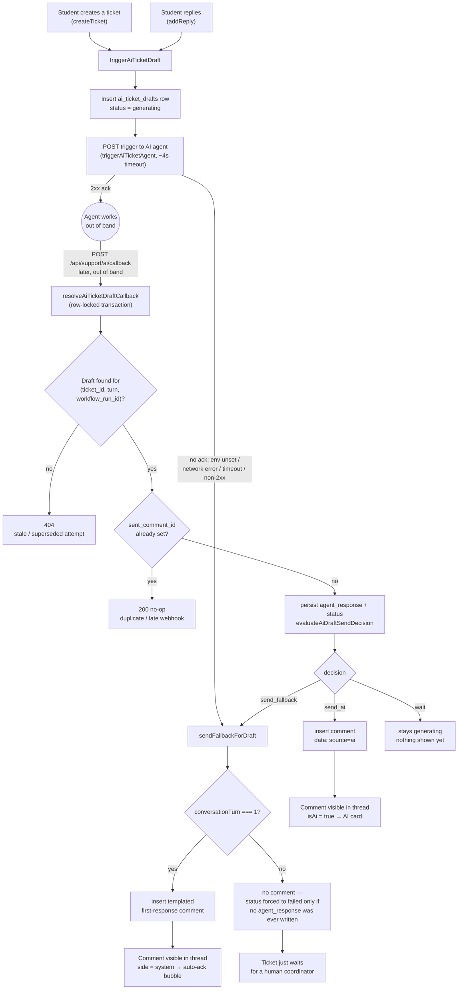
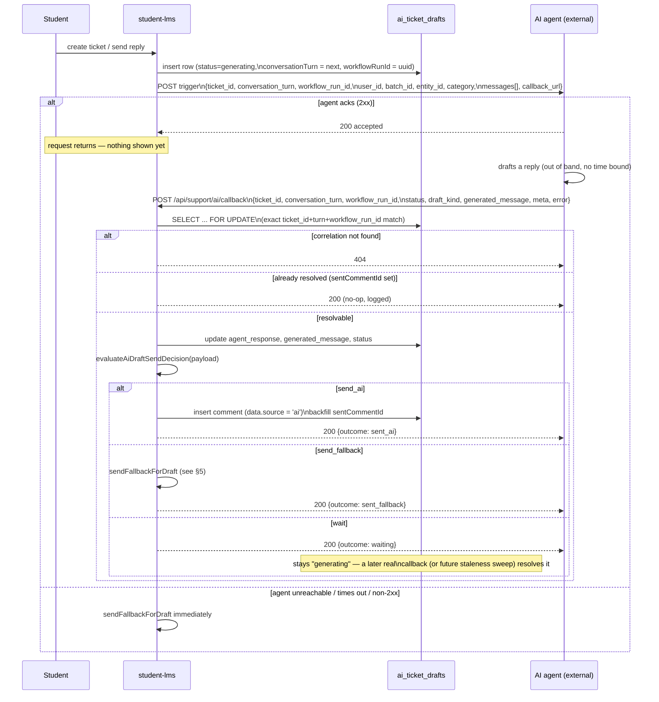

# AI-Drafted Ticket Replies — Flow Reference

> **Purpose of this doc:** a single map of how a ticket turn goes from
> "student typed something" to "a reply appears in the thread" now that an
> external AI agent drafts the first attempt at every turn. Covers the
> trigger, the webhook callback, the fallback safety net, and how the result
> renders in the floating chat UI.

Code lives under `src/server/api/support/services/aiTicket*` (trigger/agent/
callback/fallback), `src/server/api/support/handlers/aiTicketCallback.handler.ts`,
`src/routes/api/support/ai/callback.ts`, and the `ai_ticket_drafts` table in
`src/db/schema.ts`.

---

## 1. One-line summary

Every conversation turn — ticket creation (turn 1) and every student reply
(turn 2, 3, …) — fires an async request to an external AI agent that attempts
to draft a reply. The agent acks the trigger immediately and calls our webhook
later with the real answer (or a failure/handoff). Nothing is shown to the
student until the outcome is known: either the AI's answer, a templated
fallback (turn 1 only), or — for a failed reply-turn — nothing at all, and the
ticket just waits for a human coordinator.

---

## 2. System flow

---

## 3. One turn, in sequence

This is the same path for turn 1 (`createTicket`) and turn N (`addReply`) —
only the trigger point differs.

---

## 4. The send decision (`evaluateAiDraftSendDecision`)

Pure function, no DB access — decides what a webhook payload means:

| `status`     | `draft_kind`                     | `generated_message` | Decision          |
| ------------ | -------------------------------- | ------------------- | ----------------- |
| `ready`      | `answer` / `clarifying_question` | non-empty           | **send_ai**       |
| `ready`      | `answer` / `clarifying_question` | empty / missing     | **send_fallback** |
| `failed`     | _(any)_                          | _(any)_             | **send_fallback** |
| _(any)_      | `handoff`                        | _(any)_             | **send_fallback** |
| `generating` | anything else / unrecognized     | _(any)_             | **wait**          |

`wait` means: don't guess. The draft stays `generating` until a real terminal
callback arrives (a `generating` status arriving as a "final" webhook, or an
unrecognized `draft_kind`, is never treated as done).

---

## 5. The fallback (`sendFallbackForDraft`) — turn 1 vs turn > 1

One shared function, called from three places: an immediate trigger-call
failure, the webhook's `send_fallback` decision, and (not yet wired) a future
staleness sweep for "the agent never called back at all."

| Turn         | What happens                                                                                                                  | Why                                                                                                                                                                                                                                                 |
| ------------ | ----------------------------------------------------------------------------------------------------------------------------- | --------------------------------------------------------------------------------------------------------------------------------------------------------------------------------------------------------------------------------------------------- |
| **Turn 1**   | Inserts the legacy templated first-response comment ("Thank you for reaching out... 48 hours..."), backfills `sentCommentId`. | Same copy the old synchronous flow always sent on ticket creation — a reasonable first-contact ack regardless of whether the AI could help.                                                                                                         |
| **Turn > 1** | **No comment is sent, ever.** Whether `status` also gets force-set to `failed` depends on the caller — see below.             | The turn-1 template is a _first-contact_ greeting — resending it mid-conversation would read as spammy/broken. The ticket just waits for a human, exactly as if there were no AI. **Confirmed as intended product behavior**, not silently assumed. |

`sent_comment_id` FKs to `comments.id` and can't hold a sentinel value for "no
comment, but resolved" — so `sendFallbackForDraft` takes a `markFailed` option
(default `true`) that decides whether `status` gets force-set to `failed` as
the substitute signal:

- **Trigger-call failure** (`markFailed: true`, the default) — the agent never
  got the request at all, so nothing else on the row indicates this attempt is
  done. `status` is stamped `failed` so a future pending-check doesn't treat it
  as stuck in `generating` forever.
- **Webhook's `send_fallback` decision** (`markFailed: false`) — by this point
  `resolveAiTicketDraftCallback` has already written the real `agent_response`
  - `status` onto the row moments earlier, in the same transaction. That's
    already proof the draft is resolved, so `sendFallbackForDraft` leaves it
    alone here instead of clobbering the agent's true reported status (e.g.
    overwriting a truthful `ready` into `failed`).

---

## 6. Idempotency & correlation

- **Correlation** is an exact match on `(ticket_id, conversation_turn, workflow_run_id)`. A mismatched `workflow_run_id` (e.g. a stale/superseded retry) is rejected with 404 — never processed.
- **Idempotency** keys off `sent_comment_id IS NULL`, not a status enum — once a draft has a `sent_comment_id`, any further webhook for it is a no-op (logged, 200).
- **Concurrency**: the webhook runs inside `SELECT ... FOR UPDATE` so two near-simultaneous callbacks for the same draft can't both send.

---

## 7. UI rendering

- `comments.data = { source: 'ai', aiTicketDraftId }` on the AI-sent comment (mirrors the existing `firstTemplateResponse` marker convention — no schema change on `comments`).
- `tickets.read.service.ts` maps that to `TicketMessage.isAi = true` (side stays `'agent'`).
- `ChatThread.tsx` renders a distinct "AI Assistant" card (teal/blue, `info` design tokens, "AI at work" disclaimer) instead of the human coordinator's dark bubble or the purple system auto-ack.
- `assigneeDividerPlacements` skips AI messages when deciding where the "Chat with {coordinator}" divider anchors — an AI-only thread shows no divider yet; the divider appears above the first real human reply.

---

## 8. Not yet wired (out of scope for this pass)

- **Staleness sweep**: if the agent never calls back at all (crash/timeout), nothing currently resolves the draft. The plan calls for a lazy check at the top of `getTicketThread` (no cron) — not implemented yet.
- **`hasPendingAiDraft` + client polling**: `TicketDetail.hasPendingAiDraft` and the conditional `refetchInterval` on `ticketThreadQuery` aren't wired yet, so the floater doesn't currently show a "thinking" state or auto-poll while a draft is outstanding.

Both depend on the fallback/staleness logic above and can reuse `sendFallbackForDraft` as-is once wired in.
